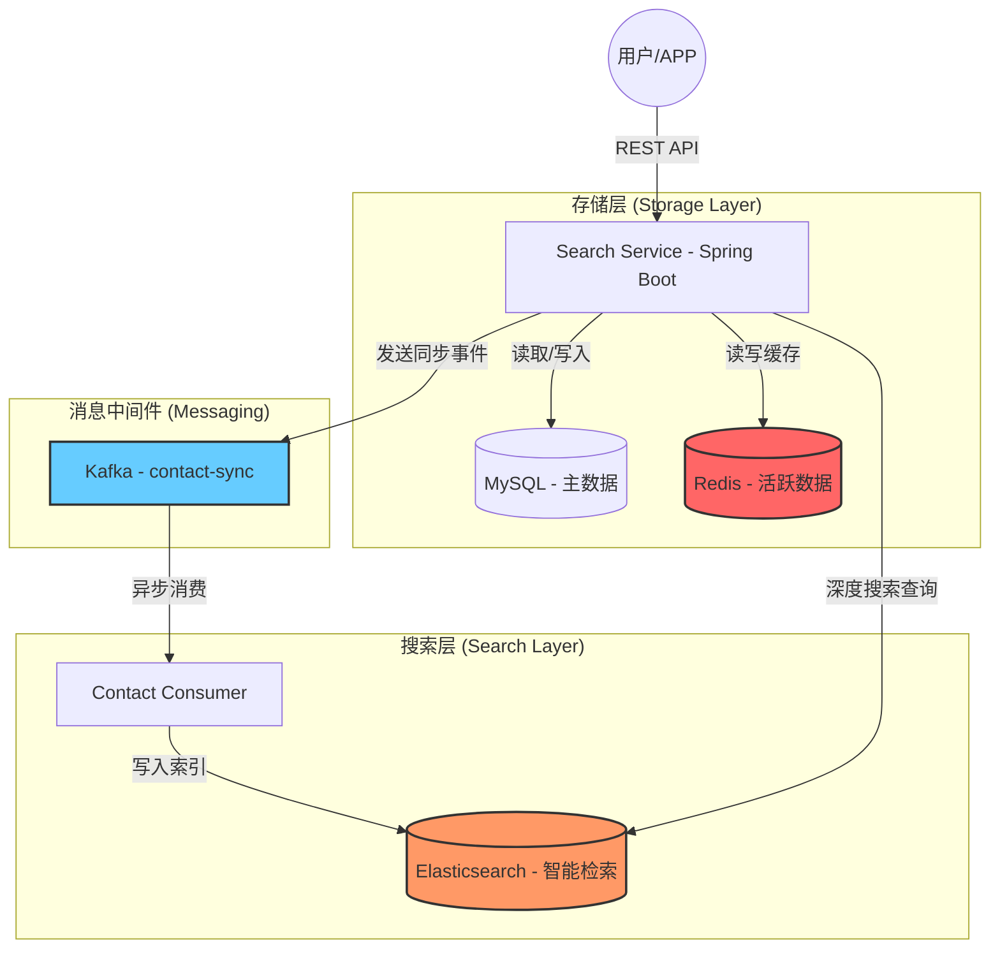

# Transfer Contact Smart Search System

这是一个构建于 **Java 17** 和 **Spring Boot 3.x** 的微服务工程，旨在为银行 APP 提供高性能、智能化的转账联系人（通讯录）搜索功能。

---

## 1. 需求分析 (Requirement Analysis)

### 1.1 功能性需求 (Functional Requirements)
- **多维智能搜索**：支持姓名（全称）、拼音（全拼/简拼）、首字母、拼音前缀及中英混输。
- **搜素联想 (Suggest)**：基于前缀的实时补全，提供毫秒级交互体验。
- **语音搜索支持**：解析语音识别后的文本（如“给张三转账”），提取关键联系人进行检索。
- **最近联系人提权**：结合用户交易频率，利用 Redis 缓存最近转账对象，在搜索结果中动态提权。
- **搜索高亮与元数据**：返回匹配字段、高亮名称、原始分数及生成的 DSL 语句，便于 UI 展示与调试。

### 1.2 非功能性需求 (Non-Functional Requirements)
- **高性能**：搜索接口响应时间（P99）应小于 200ms。
- **高可用与一致性**：利用 Kafka 实现 MySQL 与 Elasticsearch 之间的异构数据最终一致性。
- **可扩展性**：支持千万级联系人数据的亚秒级检索。
- **易调试性**：提供分析器调试接口，可视化分词逻辑。

---

## 2. 详细架构设计 (Architecture Design)

### 2.1 系统架构图


### 2.2 数据流描述
1.   **写入路径 (Write Path)**：
     - APP 调用新增接口。
     - 业务逻辑持久化数据至 MySQL。
     - 发送 `ContactDocument` 事件到 Kafka `contact-sync` Topic。
     - 异步消费者从 Kafka 拉取数据并写入 Elasticsearch 索引。
2.   **读取路径 (Read Path)**：
     - APP 通过关键词发起搜索。
     - 服务端从 Redis 获取当前用户的最近转账联系人名单。
     - 构建复合 `Function Score Query` 请求 Elasticsearch。
     - 返回经过权重排序、高亮处理的结果。

---

## 3. 数据结构设计 (Data Structures)

### 3.1 关系型数据库 (MySQL: `transfer_contact`)
| 字段名 | 类型 | 描述 |
| :--- | :--- | :--- |
| `id` | BIGINT (PK) | 主键 ID (时间戳/雪花 ID) |
| `user_id` | BIGINT | 用户 ID (逻辑分区) |
| `contact_name` | VARCHAR(100) | 联系人姓名 |
| `contact_pinyin` | VARCHAR(255) | 姓名全拼 |
| `contact_initial` | VARCHAR(50) | 姓名首字母简拼 |
| `bank_name` | VARCHAR(100) | 银行名称 |
| `account_no` | VARCHAR(50) | 银行卡号 |
| `phone` | VARCHAR(20) | 手机号 |
| `create_time` | DATETIME | 创建时间 |

### 3.2 搜索文档模型 (Elasticsearch: `transfer_contact_index`)
-   **Routing**: 按 `userId` 路由，确保同一用户数据在同一分片，提升性能。
-   **自定义分词器 (`pinyin_analyzer`)**:
    -   **Tokenizer**: `edge_ngram` (1-20 characters)，支持拼音前缀匹配。
    -   **Filters**: `lowercase`。

| 字段名 | 类型 | 索引/分词配置 |
| :--- | :--- | :--- |
| `id` | long | - |
| `userId` | long | Keyword 过滤 |
| `contactName` | text | `ik_max_word` (中文分词) |
| `contactPinyin` | text | `pinyin_analyzer` (支持拼音前缀) |
| `contactInitial`| keyword | 精确匹配 |
| `bankName` | text | `ik_max_word` |
| `contactSuggest`| completion | 实现 Suggestion 联想功能 |

### 3.3 缓存设计 (Redis)
-   **Key Pattern**: `recent:contacts:{userId}`
-   **Data Type**: `ZSet` (Sorted Set)
    -   **Member**: 联系人姓名 (`contactName`)
    -   **Score**: 交易时间戳 (`timestamp`)
-   **TTL**: 视业务需求而定，通常保留最近 10-20 条记录。

---

## 4. 智能搜索逻辑 (Search Logic)

### 4.1 复合评分策略 (Scoring Weights)
系统采用 `function_score` 动态调整搜索结果排序：

1.  **姓名精确匹配 (Name Match)**: 权重 **5.0**
2.  **首字母匹配 (Initial Match)**: 权重 **4.0**
3.  **拼音匹配 (Pinyin Match)**: 权重 **3.0**
4.  **银行名匹配 (Bank Match)**: 权重 **1.0**
5.  **最近联系人提权 (Recent Boost)**: 命中 Redis 记录后的附加权重 **10.0**

### 4.2 模糊匹配逻辑
引入 `fuzzy: AUTO` 查询，基于 **Levenshtein Distance** 允许 1-2 个字符的拼音输入误差（如 `zagn` 可匹配 `zhang`）。

---

## 5. 快速启动与构建

### 5.1 环境要求
- Docker & Docker Compose
- Maven 3.8+
- JDK 17

### 5.2 启动步骤
```bash
# 1. 编译项目
mvn clean package -DskipTests

# 2. 启动容器集群 (MySQL, Redis, Kafka, ES)
docker-compose up -d --build

# 3. 验证健康状态
curl http://localhost:8080/actuator/health
```

---

## 6. 接口协议示例

### 6.1 智能搜索接口
**GET** `/contacts/search?userId=1001&keyword=zs`

**响应预览**:
```json
{
  "results": [
    {
      "contactName": "张三",
      "highlightName": "<em>张三</em>",
      "matchedFields": ["contactInitial", "contactName"],
      "score": 15.42
    }
  ],
  "took": 45,
  "dsl": "{...}"
}
```

---

## 7. 目录结构
- `controller`: API 层，包括常规搜索与语音语义搜索。
- `service`: 核心业务逻辑，协调 MySQL 与 Redis。
- `search`: Elasticsearch 复合查询构建器 (DSL generator)。
- `kafka`: 消息生产者与消费者封装，处理索引同步。
- `entity/dto`: 领域模型与传输对象。
- `util`: 包含 `PinyinUtil` 等辅助工具。

